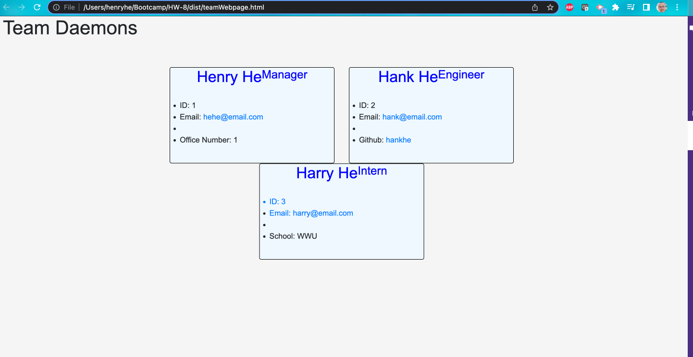

#Team Page Generator

##Table Of Contents
  *[Installation](#installation)
  *[Usage](#usage) 
  *[Contributions](#contributions)
  *[Technologies Used](#technologies-used)
  *[Screenshots](#screenshots)
  *[Questions](#questions)

## Installation
Clone this repository then on the CLI run: 
    *npm i

## Usage
After installing the npm packages, enter:
    npm run test
This runs the test files

Then enter
    node index.js
This runs the generator app

This application is covered by the following license: MIT.

## Contributions
All people can contribute! 

## Technologies Used
JavaScript, Jest, Inquirer

## Screenshots

## Questions
If you have any questions, please contact me using the links below:
Github: https://github.com/hghe95
Email: hghe95@gmail.com
Walkthrough Video: https://drive.google.com/file/d/13alKTKBlP8TqWfEQ1PhSPRRXUn_nZlcx/view